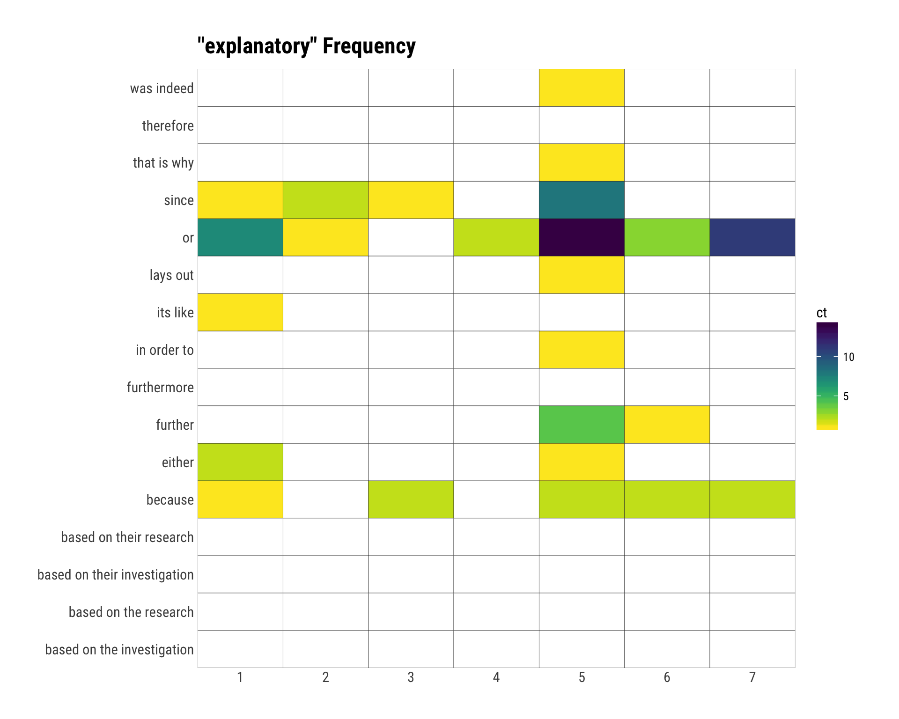
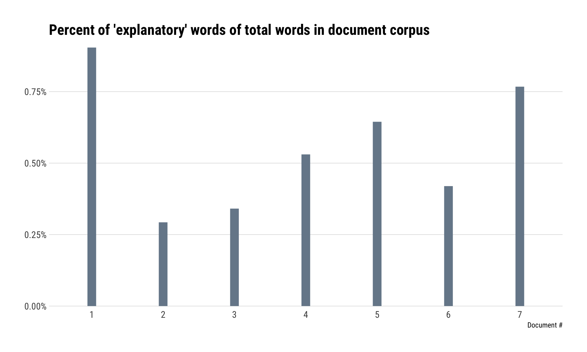
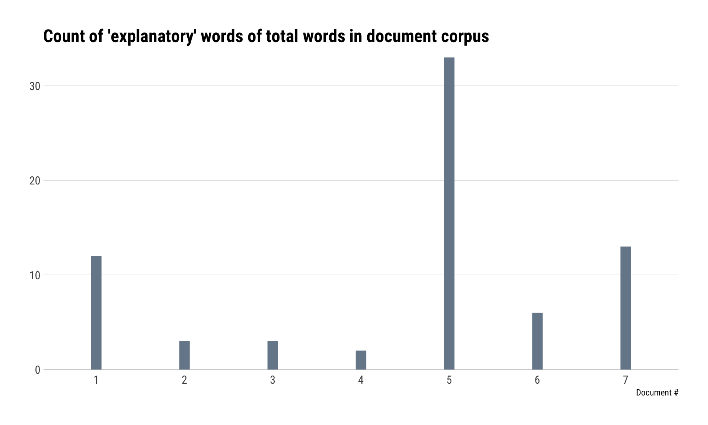
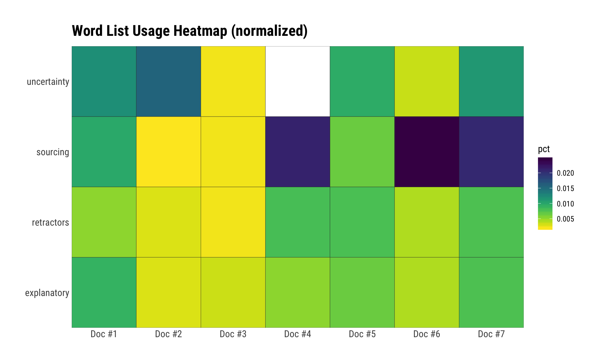

# misinfo

Tools to Perform ‘Misinformation’ Analysis on a Text Corpus

## Description

Tools to Perform ‘Misinformation’ Analysis on a Text Corpus

## What’s Inside The Tin

The following functions are implemented:

  - `mi_analyze_document`: Run a one or more documents through a
    misinformation/bias sentiment analysis
  - `mi_plot_document_summary`: Plot raw frequency count summary from a
    processed corpus
  - `mi_plot_individual_frequency`: Plot raw frequency count summary
    from a processed corpus
  - `mi_use_builtin`: Use a built-in ‘sentiment’ word/phrase list
  - `word_doc_to_txt`: Convert a Word document to a plaintext document

## Installation

``` r
devtools::install_github("hrbrmstr/misinfo")
```

## Usage

``` r
library(misinfo)
library(hrbrthemes)
library(tidyverse)

# current verison
packageVersion("misinfo")
```

    ## [1] '0.1.0'

### Try it out on the built-in corpus

``` r
mi_analyze_document(
  path = system.file("extdat", package="misinfo"),
  pattern = ".*txt$",
  bias_type = "explanatory",
  sentiment_list = mi_use_builtin("explanatory")
) -> corpus
```

``` r
glimpse(corpus)
```

    ## List of 4
    ##  $ bias_type           : chr "explanatory"
    ##  $ corpus              :Classes 'tbl_df', 'tbl' and 'data.frame':    7 obs. of  3 variables:
    ##   ..$ doc   : chr [1:7] "CNET - How US cybersleuths decided Russia hacked the DNC" "CNN - DNC hack" "IVN - CNN Covering For DNC Corruption" "Red Nation- FBI Didn't Analyze DNC servers" ...
    ##   ..$ text  : chr [1:7] "how us cybersleuths decided russia hacked the dnc  digital clues led security pros to agencies in putins govern"| __truncated__ "dnc hack what you need to know  by tal kopan cnn  updated 130 pm et tue june 21 2016  cyber experts russia hack"| __truncated__ "cnn covering for dnc corruption  by jeff powers in opinion jun 27 2017  we should have known this hysteria woul"| __truncated__ "fbi didnt analyze dnc servers before issuing hacking report  posted at 839 pm on january 4 2017 by jennifer van"| __truncated__ ...
    ##   ..$ doc_id: chr [1:7] "CNET - How US cybersleuths dec" "CNN - DNC hack" "IVN - CNN Covering For DNC Cor" "Red Nation- FBI Didn't Analyze" ...
    ##  $ frequency_summary   :Classes 'tbl_df', 'tbl' and 'data.frame':    7 obs. of  5 variables:
    ##   ..$ doc_id     : chr [1:7] "CNET - How US cybersleuths dec" "CNN - DNC hack" "IVN - CNN Covering For DNC Cor" "Red Nation- FBI Didn't Analyze" ...
    ##   ..$ n          : int [1:7] 12 3 3 2 33 6 13
    ##   ..$ doc_num    : chr [1:7] "1" "2" "3" "4" ...
    ##   ..$ total_words: int [1:7] 1327 1024 880 377 5119 1430 1694
    ##   ..$ pct        : num [1:7] 0.00904 0.00293 0.00341 0.00531 0.00645 ...
    ##  $ individual_frequency:Classes 'tbl_df', 'tbl' and 'data.frame':    119 obs. of  6 variables:
    ##   ..$ doc_id     : chr [1:119] "CNET - How US cybersleuths dec" "CNN - DNC hack" "IVN - CNN Covering For DNC Cor" "Red Nation- FBI Didn't Analyze" ...
    ##   ..$ keyword    : chr [1:119] "because" "because" "because" "because" ...
    ##   ..$ ct         : int [1:119] 1 0 2 0 2 2 2 0 0 0 ...
    ##   ..$ doc_num    : chr [1:119] "1" "2" "3" "4" ...
    ##   ..$ total_words: int [1:119] 1327 1024 880 377 5119 1430 1694 1327 1024 880 ...
    ##   ..$ pct        : num [1:119] 0.000754 0 0.002273 0 0.000391 ...
    ##  - attr(*, "class")= chr "misinfo_corpus"

``` r
corpus$frequency_summary
```

    ## # A tibble: 7 x 5
    ##   doc_id                             n doc_num total_words     pct
    ##   <chr>                          <int> <chr>         <int>   <dbl>
    ## 1 CNET - How US cybersleuths dec    12 1              1327 0.00904
    ## 2 CNN - DNC hack                     3 2              1024 0.00293
    ## 3 IVN - CNN Covering For DNC Cor     3 3               880 0.00341
    ## 4 Red Nation- FBI Didn't Analyze     2 4               377 0.00531
    ## 5 The Nation - A New Report Rais    33 5              5119 0.00645
    ## 6 VOA- Think Tank- Cyber Firm at     6 6              1430 0.00420
    ## 7 WaPo - DNC hack                   13 7              1694 0.00767

``` r
corpus$individual_frequency
```

    ## # A tibble: 119 x 6
    ##    doc_id                         keyword      ct doc_num total_words      pct
    ##    <chr>                          <chr>     <int> <chr>         <int>    <dbl>
    ##  1 CNET - How US cybersleuths dec because       1 1              1327 0.000754
    ##  2 CNN - DNC hack                 because       0 2              1024 0       
    ##  3 IVN - CNN Covering For DNC Cor because       2 3               880 0.00227 
    ##  4 Red Nation- FBI Didn't Analyze because       0 4               377 0       
    ##  5 The Nation - A New Report Rais because       2 5              5119 0.000391
    ##  6 VOA- Think Tank- Cyber Firm at because       2 6              1430 0.00140 
    ##  7 WaPo - DNC hack                because       2 7              1694 0.00118 
    ##  8 CNET - How US cybersleuths dec therefore     0 1              1327 0       
    ##  9 CNN - DNC hack                 therefore     0 2              1024 0       
    ## 10 IVN - CNN Covering For DNC Cor therefore     0 3               880 0       
    ## # ... with 109 more rows

``` r
mi_plot_individual_frequency(corpus)
```


``` r
mi_plot_individual_frequency(corpus, FALSE)
```



``` r
mi_plot_document_summary(corpus)
```



``` r
mi_plot_document_summary(corpus, FALSE)
```



### Compare a corpus across a bunch of biases

``` r
map_df(c("uncertainty", "sourcing", "retractors", "explanatory"), ~{
  
  # compute individual bias scores
  mi_analyze_document(
    path = system.file("extdat", package="misinfo"),
    pattern = ".*txt$",
    bias_type = .x,
    sentiment_list = mi_use_builtin(.x)
  ) -> corpus
  
 mutate(corpus$frequency_summary, bias = corpus$bias_type)
  
}) -> biases

mutate(biases, pct = ifelse(pct == 0, NA, pct)) %>% 
  ggplot(aes(sprintf("Doc #%s", doc_num), bias, fill=pct)) +
  geom_tile(color="#2b2b2b", size=0.125) +
  scale_x_discrete(expand=c(0,0)) +
  scale_y_discrete(expand=c(0,0)) +
  viridis::scale_fill_viridis(direction=-1, na.value="white") +
  labs(x=NULL, y=NULL, title="Word List Usage Heatmap (normalized)") +
  theme_ipsum_rc(grid="")
```



``` r
distinct(biases, doc_num, doc_id, total_words) %>% 
  knitr::kable(format="markdown")
```

| doc\_id                        | doc\_num | total\_words |
| :----------------------------- | :------- | -----------: |
| CNET - How US cybersleuths dec | 1        |         1327 |
| CNN - DNC hack                 | 2        |         1024 |
| IVN - CNN Covering For DNC Cor | 3        |          880 |
| Red Nation- FBI Didn’t Analyze | 4        |          377 |
| The Nation - A New Report Rais | 5        |         5119 |
| VOA- Think Tank- Cyber Firm at | 6        |         1430 |
| WaPo - DNC hack                | 7        |         1694 |
